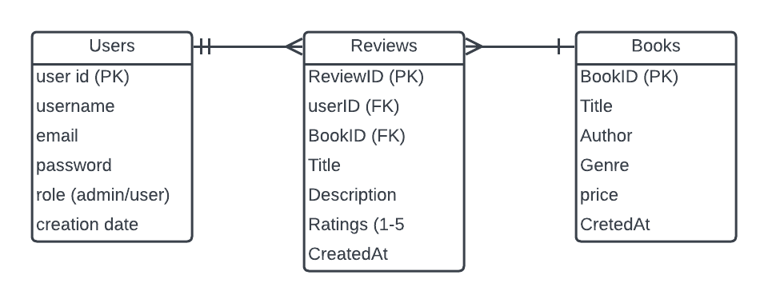
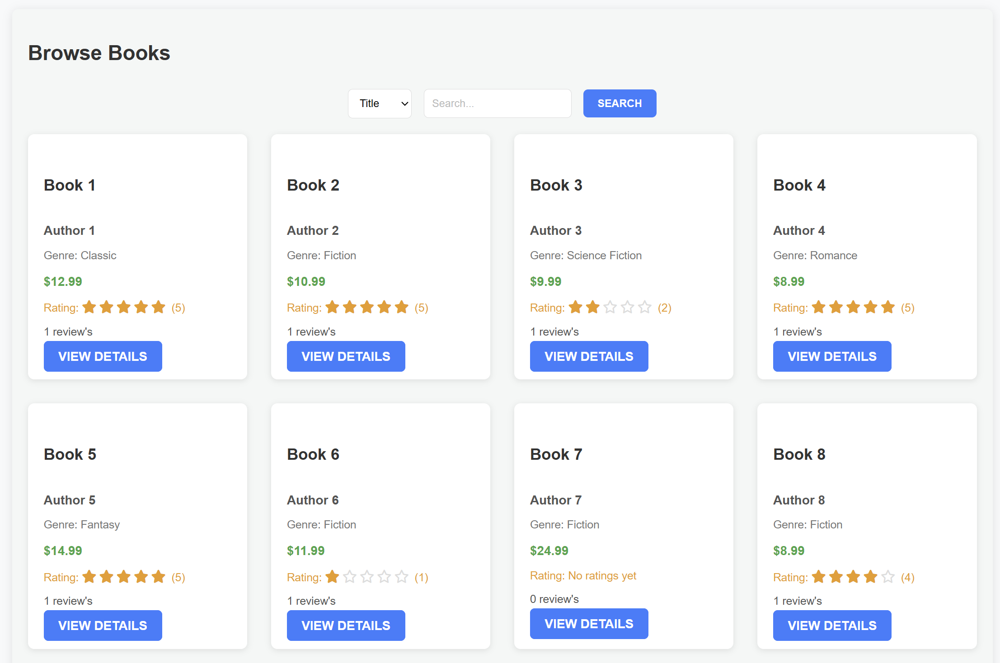
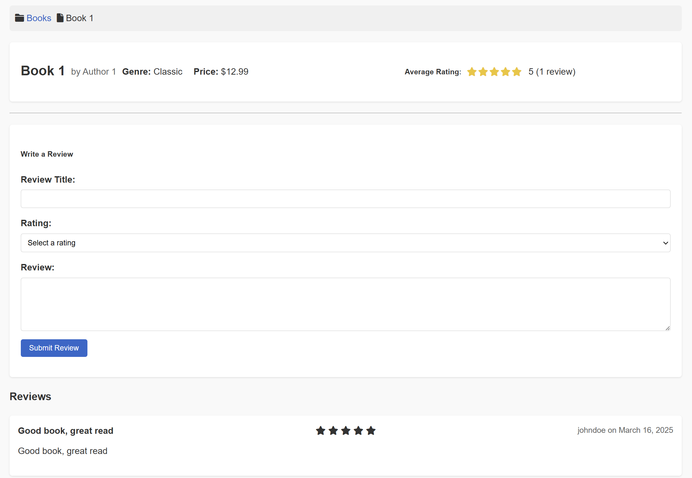
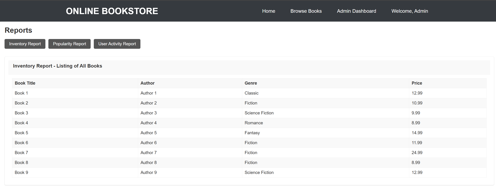
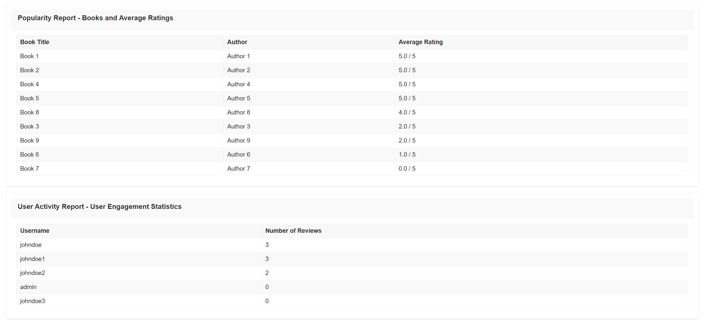
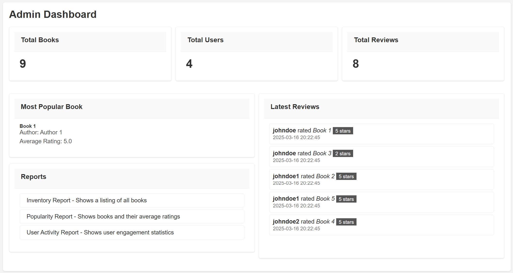

# Online Bookstore Database and PHP Implementation

## 1. Introduction

The following has all required information requested for the Databse Midterm.

## 2. Entity-Relationship Diagram (ERD)




**Explanation**:  
One user may review many books but only review a book once and a book may recieve multiple reviews

## 3. Database Design

### Table Structure:  

```sql
-- database creation
create database bookstore;
use bookstore;

-- users table
create table users (
    user_id int auto_increment primary key,
    username varchar(50) not null unique,
    email varchar(100) not null unique,
    password varchar(255) not null,
    role enum('admin', 'customer') not null default 'customer',
    created_at timestamp default current_timestamp
);

-- books table
create table books (
    book_id int auto_increment primary key,
    title varchar(255) not null,
    author varchar(100) not null,
    genre varchar(50) not null,
    price decimal(10, 2) not null,
    created_at timestamp default current_timestamp
);

-- reviews table
create table reviews (
    review_id int auto_increment primary key,
    user_id int not null,
    book_id int not null,
    title varchar(100) not null,
    description text not null,
    rating int not null check (rating between 1 and 5),
    created_at timestamp default current_timestamp,
    foreign key (user_id) references users(user_id) on delete cascade,
    foreign key (book_id) references books(book_id) on delete cascade,
    unique(user_id, book_id)
);
```

### 4. Test Data

```sql
-- Test data: Customer users
INSERT INTO users (username, email, password, role) VALUES 
('johndoe', 'john@example.com', 'password', 'customer'),
('johndoe1', 'john1@example.com', 'password', 'customer'),
('johndoe2', 'john2@example.com', 'password', 'customer'),
('johndoe3', 'john3@example.com', 'password', 'customer');

-- Test data: Books
INSERT INTO books (title, author, genre, price) VALUES
('Book 1', 'Author 1', 'Classic', 12.99),
('Book 2', 'Author 2', 'Fiction', 10.99),
('Book 3', 'Author 3', 'Science Fiction', 9.99),
('Book 4', 'Author 4', 'Romance', 8.99),
('Book 5', 'Author 5', 'Fantasy', 14.99),
('Book 6', 'Author 6', 'Fiction', 11.99),
('Book 7', 'Author 7', 'Fiction', 24.99),
('Book 8', 'Author 8', 'Fiction', 8.99),
('Book 9', 'Author 9', 'Science Fiction', 12.99);

-- Test data: Reviews
INSERT INTO reviews (user_id, book_id, title, rating, description) VALUES
(2, 1, 'Good book, great read', 5, 'Good book, great read'),
(2, 3, 'Bad book, bad read', 2, 'Bad book, bad read'),
(3, 2, 'Good book, great read', 5, 'Good book, great read'),
(3, 5, 'Good book, great read', 5, 'Good book, great read'),
(4, 4, 'Good book, great read', 5, 'Good book, great read'),
(4, 6, 'Bad book, bad read', 1, 'Bad book, bad read'),
(2, 8, 'Good book, great read', 4, 'Good book, great read'),
(3, 9, 'Bad book, bad read', 2, 'Bad book, bad read');

```
---

## 5. PHP 

### 5.1 Database Connection
 
[Database Connection Script](includes/db.php)

### 5.2 User Authentication (Login/Registration)
 
[Login Script](login/login.php)

### 5.3 Registration Script (Login/Registration)

[Registration Script](login/register.php)

### 5.4 Book browsing (browsing/Review)

[Book browsing](pages/books.php)

### 5.5 Review system (browsing/Review)

[Review system](pages/book_details.php)

### 5.6 Admin Page (Dashboard/Reports)

[Admin Page](admin/dashboard.php)

### 5.6 Reports Page (Dashboard/Reports)

[Reports Page](admin/reports.php)

---

## 6. Screenshots

**Login Page**:  

<h2>Login Page</h2>


<h2>Book Browsing Page</h2>




<h2>Review Entry Page</h2>




<h2>Admin Report Page</h2>




<h2>Admin Interface</h2>




---

## 7. References

**External Resources**:  

I used Font Awsome for the stars on my site

https://fontawesome.com - > https://cdnjs.cloudflare.com/ajax/libs/font-awesome/6.0.0/css/all.min.css

